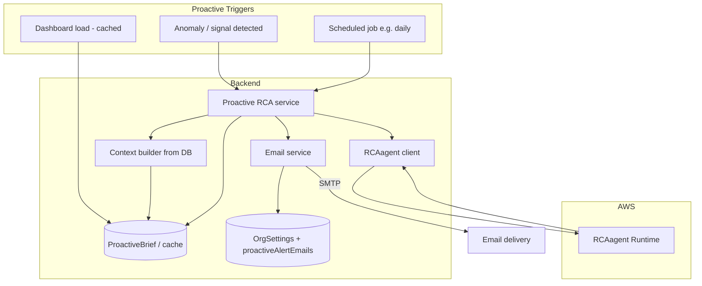

# Plan: Proactive RCA Agent for Business Queries and Decisions

## Goal

Make the RCA agent **proactive**: it runs without the user having to ask, surfaces root-cause insights and recommended actions, and delivers them via **email** (dynamic recipients). Triggers: **(1) when anomalies/live signals are detected**, **(2) on a schedule** (e.g. daily brief), and **(3) when the user opens the dashboard** (pre-computed or cached insights / suggested questions). WhatsApp is out of scope for now; email is the primary channel.

---

## Current State (relevant pieces)

- **Monitors**: [computeAllMonitors](backend/src/services/monitors/computeAll.ts) computes liveSignals and KPIs, then upserts [DashboardState](backend/src/models/DashboardState.ts) (liveSignals, kpiSummary). It is called from dashboard load, settings, and upload flows ([dashboard.ts](backend/src/routes/dashboard.ts), [settings.ts](backend/src/routes/settings.ts), [uploadController.ts](backend/src/controllers/uploadController.ts)).
- **Email**: [emailService](backend/src/services/emailService.ts) sends via nodemailer; [buildSignalInsightEmail](backend/src/services/emailService.ts) builds one-signal HTML. Org-specific SMTP from [OrgSettings](backend/src/models/OrgSettings.ts); recipients today are department emails from `OrgSettings.departments[].email`.
- **Recipients**: No single “proactive alerts” list yet. Options: add a **proactiveAlertEmails** (string[]) on OrgSettings per tenant, or derive from User emails for that tenant (e.g. all admins). Plan assumes a **configurable list per org** (e.g. `proactiveAlertEmails` in OrgSettings) so “dynamic” means per-tenant config, not hardcoded.

---

## Architecture (target)

- **Proactive RCA service**: Builds context from DB (same idea as reactive plan), calls RCAagent, formats result into a **brief** (summary, root causes, actions), stores it (for dashboard and idempotency), and **sends email** to the org’s configured recipients.
- **Triggers** feed into this service (or read from cache). **Email** is the primary output; dashboard can show the last brief or “suggested questions” from that brief.

---

## 1. Proactive RCA service (core)

- **Location**: e.g. `backend/src/services/proactive/` or `backend/src/services/analysis/proactiveRca.ts`.
- **Responsibilities**:
  - **Input**: `organizationId`, optional `triggerType` ('signal' | 'scheduled' | 'dashboard'), optional `signalId` or `signalIds[]` (for signal-triggered runs).
  - **Steps**:
    1. Load **context** from DB (reuse or share the same context builder as reactive plan: DashboardState.liveSignals, kpiSummary, Anomalies, optional aggregates). If `signalId` is set, restrict or emphasize that signal in the context.
    2. Build **prompt** for RCAagent: e.g. “Proactive brief: here is the current state of the business. [Context]. What are the main risks, root causes, and recommended actions?”
    3. Call **RCA client** (InvokeAgentRuntime) with that prompt; get `result`, `reasoning_log`, `evidence`, `recommendations`.
    4. **Format brief**: title (e.g. “Daily decision brief” or “Alert: critical signal”), summary paragraph, bullet list of root causes / risks, bullet list of recommended actions, optional “View in app” link.
    5. **Persist** the brief (see §4) for dashboard and to avoid duplicate emails in a short window.
    6. **Resolve recipients**: from OrgSettings `proactiveAlertEmails` (or fallback: User emails for this tenant). If no recipients, skip send and only store.
    7. **Send email** via existing [sendEmail](backend/src/services/emailService.ts) with a new **proactive brief** HTML template (subject + body).
- **Idempotency / throttling**: For **signal-triggered** runs, optionally debounce (e.g. one run per org per N minutes) or only run when there is at least one **new** critical/high signal since last run. Use stored “last run at” or “last brief” in DB.

---

## 2. Email: template and recipients

- **New template**: Add e.g. `buildProactiveBriefEmail({ subject, summary, rootCauses[], actions[], viewInAppUrl?, triggerType })` in [emailService.ts](backend/src/services/emailService.ts). Reuse styling approach of [buildSignalInsightEmail](backend/src/services/emailService.ts) (Nexus branding, sections for summary / causes / actions). Subject examples: “Proactive RCA: critical signals” (signal), “Your daily decision brief” (scheduled), “Insights ready” (dashboard-triggered).
- **Recipients**: **Dynamic per tenant.** Add optional field to [OrgSettings](backend/src/models/OrgSettings.ts), e.g. `proactiveAlertEmails: string[]` (or a single `proactiveAlertEmail`). If missing, fallback: query [User](backend/src/models/User.ts) for that tenant and use `user.email` (e.g. all users or only role `admin`). Document in settings UI that “Proactive alerts will be sent to these addresses.”
- **Sending**: One email per run to all resolved recipients (or BCC to avoid exposing addresses). Use existing `sendEmail(organizationId, { to, subject, html })`; if multiple recipients, either loop `to` or use a single “to” and BCC the rest (depending on nodemailer API).

---

## 3. Triggers

### 3a. Anomaly / signal detected

- **When**: After the monitors have produced new liveSignals (e.g. after [computeAllMonitors](backend/src/services/monitors/computeAll.ts) completes).
- **Where**: In the same flow that calls `computeAllMonitors`, add a **fire-and-forget** (or queued) call to the proactive service, e.g. `runProactiveRcaIfNeeded(organizationId, { triggerType: 'signal' })`. Do not block the dashboard/settings/upload response.
- **Condition**: Run only if there is at least one **critical** or **high** severity liveSignal (or configurable threshold). Optionally pass the top signal IDs so the prompt can say “Focus on signal X”.
- **Throttling**: e.g. at most one email per org per 30–60 minutes for signal-triggered runs (store `lastProactiveEmailAt` per org in DB or in a small ProactiveRun collection and skip if within window).

### 3b. Scheduled (e.g. daily) brief

- **Mechanism**: Use a **scheduler** inside the Node process (e.g. `node-cron`) or an **HTTP endpoint** that a system cron calls (e.g. `GET /api/cron/proactive-brief` with a shared secret or Vercel cron token). Prefer endpoint if the app is serverless or multi-instance so only one instance runs the job.
- **Logic**: For each organization that has data (e.g. has DashboardState or has run analysis in last 7 days), call proactive service with `triggerType: 'scheduled'`. Optionally run only for orgs that have `proactiveAlertEmails` set. Limit concurrency (e.g. one org at a time) to avoid overloading the RCAagent and SMTP.
- **Time**: e.g. 6:00 AM org time or UTC; configurable later. First version can be fixed (e.g. 00:00 UTC daily).

### 3c. Dashboard load (cached insights / suggested questions)

- **Goal**: When the user opens the dashboard, show “proactive” value without blocking on a slow agent call.
- **Approach**: **Cache the last proactive brief** in DB (see §4). On dashboard load, the frontend calls e.g. `GET /api/dashboard/proactive-insights` (or the existing dashboard API extends its response with `proactiveBrief`). Backend returns the **last stored brief** (summary, suggested questions, or “Top 3 things to look at”). No agent call on page load.
- **Refresh**: Optionally, a “Refresh insights” button or a background job that runs the proactive service with `triggerType: 'dashboard'` and updates the cache; next dashboard load shows new content. So “dashboard” trigger = **consumption of cached brief**; the **producer** is either the scheduled job or an on-demand refresh endpoint (e.g. `POST /api/proactive/refresh` for admins).

---

## 4. Storing the brief (optional but recommended)

- **Purpose**: Avoid duplicate emails, power dashboard “last brief”, and allow “View in app” link to show the same content.
- **Option A**: New collection **ProactiveBrief** (or **DecisionBrief**): `{ organizationId, triggerType, content: { summary, rootCauses[], actions[], suggestedQuestions[] }, createdAt, emailedAt?, recipientCount? }`. One document per run; dashboard reads the latest by `organizationId`.
- **Option B**: Store on **DashboardState** or OrgSettings as `lastProactiveBrief: { summary, actions[], createdAt }` (smaller schema change, single doc per org).
- Recommendation: **Option A** for clarity and history (e.g. “Last 5 briefs” later). For “suggested questions”, the proactive service can append to the brief content a short list derived from the agent’s `result` or `recommendations` (e.g. “Ask: Why is revenue down in North?”).

---

## 5. RCAagent and context

- **Reuse**: Same **RCA client** and **context builder** as in the reactive integration plan. Context builder pulls from DashboardState, Anomalies, and optional aggregates; output is a string that goes into the prompt.
- **Prompt shape**: For proactive runs, the prompt can be tailored: e.g. “You are a proactive business advisor. Based on the following context from the company’s data, provide a short decision brief: main risks, likely root causes, and 3–5 recommended actions. Context: [context].” The agent’s `result` and `recommendations` are then formatted into the email and stored brief.

---

## 6. Configuration and feature flag

- **Feature flag**: e.g. `ENABLE_PROACTIVE_RCA=true` so proactive runs and emails can be turned off (e.g. in dev or before RCAagent is deployed).
- **Per-org**: If `proactiveAlertEmails` is empty and no fallback users, skip sending email but can still store the brief for in-app display. Optionally, an org-level “Proactive alerts: on/off” in OrgSettings.

---

## 7. Implementation checklist (high level)

| #   | Task                                                                                                                     | Notes                                                    |
| --- | ------------------------------------------------------------------------------------------------------------------------ | -------------------------------------------------------- |
| 1   | Add OrgSettings field for proactive recipients (e.g. proactiveAlertEmails) and optional “proactive enabled”              | Backend + migration or default []                        |
| 2   | Implement proactive RCA service: context + RCA client + format brief + resolve recipients + send email                   | Reuse context builder and RCA client from reactive plan  |
| 3   | Add buildProactiveBriefEmail in emailService and wire sendEmail for brief                                                | Subject/body from brief content                          |
| 4   | Add ProactiveBrief (or similar) model and store brief after each run                                                     | Dashboard reads latest by org                            |
| 5   | Hook signal-trigger: after computeAllMonitors, if critical/high signals, call proactive service (throttled)              | Fire-and-forget; throttle per org                        |
| 6   | Add scheduler or HTTP cron endpoint for scheduled brief (e.g. daily)                                                     | node-cron or GET /api/cron/proactive-brief               |
| 7   | Add API for “last proactive brief” (e.g. GET /api/dashboard/proactive-insights) and optionally extend dashboard response | Frontend can show “Suggested questions” or brief summary |
| 8   | (Optional) POST /api/proactive/refresh to trigger on-demand brief and update cache                                       | For “Refresh insights” button                            |
| 9   | Settings UI: configure proactiveAlertEmails (and optional on/off)                                                        | So “dynamic” email is configurable per tenant            |

---

## 8. Flow summary

1. **Signal trigger**: Monitors run → new critical/high liveSignals → proactive service runs (throttled) → context from DB → RCAagent → brief stored → email to proactiveAlertEmails (or tenant users).
2. **Scheduled trigger**: Cron hits endpoint or in-process cron runs → for each org with data (and optionally with recipients), run proactive service → store brief → email.
3. **Dashboard**: User opens dashboard → API returns last stored brief (no agent call) → UI shows “Today’s brief” or “Suggested questions.” Optional “Refresh” triggers a run and updates cache.

All flows use **data already in the DB** (DashboardState, anomalies, aggregates). Email is the primary delivery; WhatsApp is deferred. This plan makes the RCA agent proactive and helps the business with decisions by pushing insights to their inbox and surfacing them on the dashboard.