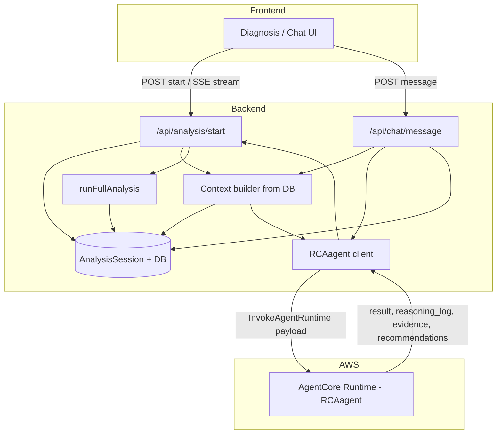

# Plan: Connect RCAagent to Frontend/Backend with DB-Backed Data

## Current state

- **Backend**: Express API; analysis runs via [runFullAnalysis](backend/src/services/analysis/runAnalysis.ts) (deterministic pipeline: anomaly detection → hypothesis library → test → rank → actions → memo). No LLM or RCAagent call. Data comes from MongoDB (AnalysisSession, Anomaly, DashboardState, RetailRecord, InventoryRecord, etc.).
- **RCAagent**: Deployed as a Bedrock AgentCore Runtime (see [RCAagent/terraform](RCAagent/terraform)). Entrypoint `invoke(payload)` in [RCAagent/src/main.py](RCAagent/src/main.py) accepts `{ prompt, thread_id?, actor_id? }` and returns `{ result, reasoning_log?, evidence?, recommendations? }`. The agent has no direct DB access; it only sees what is sent in the prompt.
- **Frontend**: Calls `POST /api/analysis/start` and SSE `GET /api/analysis/stream/:id` for diagnosis; calls `POST /api/chat/message` for chat. It expects analysis result in the shape of [AnalysisResultData](backend/src/models/AnalysisSession.ts) (rootCauses, businessImpact, actions, geoOpportunity, charts, memoMarkdown). The diagnosis store maps this in [applyResult](frontend/src/stores/diagnosisStore.ts).

---

## Architecture (target)

- **Backend** builds a **context string (or structured blob)** from the DB (anomalies, liveSignals, kpiSummary, optional aggregates), passes it to RCAagent in the **prompt** (or an extended payload if the agent supports it). Backend calls the AgentCore Runtime via **InvokeAgentRuntime**, then maps the agent response into the existing **AnalysisResultData** (or a hybrid with existing pipeline) and persists to **AnalysisSession** so the frontend keeps working without contract changes.

---

## 1. Backend: RCAagent client service

- **Purpose**: Single place that invokes the deployed RCAagent (Bedrock AgentCore Runtime).
- **Implementation**:
  - Add a small **RCA client** in the backend (e.g. `backend/src/services/rca/` or `backend/src/services/agent/`) that calls the **InvokeAgentRuntime** API.
  - Use the **AWS SDK for JavaScript** for the Bedrock AgentCore data plane (package name to confirm: e.g. `@aws-sdk/client-bedrock-agentcore` or equivalent for InvokeAgentRuntime). Backend needs AWS credentials (env or IAM role) and **runtime ARN** (from Terraform output after deploy: `agentcore_runtime_id` / full ARN).
  - **Input**: `{ prompt: string, context?: string, thread_id?: string, actor_id?: string }`. Build a single `prompt` string that includes the user query and the injected context (see §2).
  - **Output**: Parse the runtime response (streaming or full body) into `{ result: string, reasoning_log?: any, evidence?: any, recommendations?: any }` to match [RCAagent/src/main.py](RCAagent/src/main.py) return shape.
- **Config**: Env vars e.g. `RCA_AGENT_RUNTIME_ARN`, `AWS_REGION`. If ARN is missing, the client can no-op or throw a clear error so the app can fall back to the existing pipeline.

---

## 2. Backend: Context builder from DB

- **Purpose**: Give the agent enough “observations” so it can hypothesize and reason; all data comes from the existing DB.
- **Implementation**:
  - New module (e.g. `backend/src/services/rca/contextBuilder.ts` or under `services/analysis/`) that, given `organizationId` and optional `signalId` / `query`,:
    - Loads **DashboardState** (e.g. [DashboardState](backend/src/models/DashboardState.ts)) for the org: **liveSignals**, **kpiSummary** (revenue delta, OOS rate, return rate, etc.).
    - Optionally loads recent **Anomalies** ([Anomaly](backend/src/models/Anomaly.ts)) for the org.
    - Optionally adds a short summary of **RetailRecord** / **InventoryRecord** aggregates (e.g. “last 7 days revenue by day”, “top 5 OOS SKUs”) to avoid sending raw rows; keep the context size bounded (e.g. cap text length).
  - Output: a **string** (or structured JSON string) that is inserted into the prompt, e.g. “Context from your data: …” so the agent can use it in its reasoning. Optionally pass the same context in a dedicated `context` field if the agent entrypoint is extended to accept it (currently only `prompt` is used; extending payload is optional).

---

## 3. Backend: Integration points

### 3a. Analysis flow (`POST /api/analysis/start` + SSE)

- **Current**: [analysis router](backend/src/routes/analysis.ts) creates an AnalysisSession and runs `runFullAnalysis(sessionId, orgId, onProgress)`; progress and final result are pushed via SSE and stored in the session.
- **Options** (choose one for the plan):
  - **Option A – RCAagent-only (replace pipeline)**: For each analysis start, build context from DB (§2), call RCA client (§1) with prompt = user query + context, then **map** agent response to [AnalysisResultData](backend/src/models/AnalysisSession.ts) (rootCauses, businessImpact, actions, charts, memoMarkdown). Persist that into the session and keep the same SSE progress/complete contract (e.g. 1–2 synthetic steps like “Running RCA…” then “Complete”). No call to `runFullAnalysis`.
  - **Option B – Hybrid**: Run existing `runFullAnalysis` to get structured root causes, impact, actions; in parallel (or after), call RCAagent with the same context + query and use the agent’s `result` (and optionally `reasoning_log`) as the **memoMarkdown** or an additional “agent narrative” field. Session result shape stays the same; only memo/narrative source changes.
  - **Option C – Feature-flag**: Env var (e.g. `USE_RCA_AGENT=true`) to switch between Option A and current pipeline (no agent). Eases rollout and testing.

Recommendation: **Option C + Option A** when flag is on (RCAagent with context, mapped to AnalysisResultData); when flag is off, keep current `runFullAnalysis`. Option B can be a later enhancement.

- **Progress**: While the agent runs, emit 1–2 SSE progress events so the frontend still shows steps (e.g. “Gathering context”, “Running root cause analysis”).

### 3b. Chat flow (`POST /api/chat/message`)

- **Current**: [chat router](backend/src/routes/chat.ts) detects “analysis” vs “data” vs “signals” vs help; for analysis it runs `runFullAnalysis` and then `generateChatResponse`.
- **Change**: When the message is an analysis query and `USE_RCA_AGENT` is on, build context from DB (§2), call RCA client (§1) with prompt = message + context, get `result` (and optionally `reasoning_log`). Use agent `result` as the main reply text; optionally append a short “I can run a full analysis and save it to your history” with a link/action. Still create/update AnalysisSession and store the agent reply in `session.messages`. When flag is off, keep current behavior (runFullAnalysis + generateChatResponse).

---

## 4. Mapping agent response to existing contract

- RCAagent returns: `result` (text), `reasoning_log`, `evidence`, `recommendations` (structure may be list/dict from the graph state).
- Frontend and [AnalysisResultData](backend/src/models/AnalysisSession.ts) expect: `rootCauses[]`, `businessImpact`, `actions[]`, `geoOpportunity`, `charts`, `memoMarkdown`.

**Approaches**:

- **Structured output from agent**: Extend RCAagent so that when invoked by the backend, it (or a dedicated “summary” path) returns a **structured JSON** that matches or is close to AnalysisResultData (e.g. rootCauses, actions, memo). Backend then maps that JSON into AnalysisResultData and fills any missing fields (e.g. charts from DB). Requires changing [RCAagent/src/main.py](RCAagent/src/main.py) (and possibly the graph) to support a “structured” response format.
- **Backend adapter (no agent change)**: Backend treats `result` as the memo text and `recommendations` as a list of action-like items; map `recommendations` to `actions[]` with best-effort fields (title, description, priority, owner). For root causes and business impact, either: (1) parse from `result` text (fragile), or (2) run the existing **anomaly detection + hypothesis ranking** from `runFullAnalysis` only for those parts and combine: “root causes + impact from pipeline, narrative + recommendations from agent”. That gives a hybrid without changing the agent contract.

Recommendation: **Short term** use the backend adapter: agent provides narrative + recommendations; root causes and business impact can come from the existing pipeline (hybrid) or from a single “summary” step in the agent that returns structured JSON (if you add it). **Later**: add a structured output mode in RCAagent for full replacement.

---

## 5. Frontend

- **No change** if the backend keeps returning the same analysis result shape and the same SSE events. The diagnosis page and chat continue to work.
- **Optional**: If the backend adds `reasoning_log` or `evidence` to the session or API response, the frontend can show an “Evidence / reasoning” section or expandable panel (e.g. in the diagnosis result view or in chat). Not required for the first version.

---

## 6. Data flow summary

1. User starts analysis or sends a chat message.
2. Backend resolves `organizationId` (from auth).
3. **Context builder** reads from DB: DashboardState (liveSignals, kpiSummary), optional Anomalies, optional aggregates (revenue, OOS). Produces a context string.
4. **RCA client** builds prompt = query + context, calls **InvokeAgentRuntime** with that payload (and optional thread_id = session id).
5. Agent returns `result`, `reasoning_log`, `evidence`, `recommendations`.
6. **Adapter** maps to AnalysisResultData (and/or merges with existing pipeline in hybrid mode); backend saves to AnalysisSession and (for analysis) pushes SSE complete; (for chat) appends assistant message and returns response.
7. Frontend displays result as it does today (and optionally shows reasoning/evidence if exposed).

---

## 7. Implementation checklist (high level)

| #   | Task                                                                                                                   | Notes                                                  |
| --- | ---------------------------------------------------------------------------------------------------------------------- | ------------------------------------------------------ |
| 1   | Add AWS SDK dependency for Bedrock AgentCore (InvokeAgentRuntime) and env (RCA_AGENT_RUNTIME_ARN, USE_RCA_AGENT)       | Verify exact npm package for AgentCore data plane      |
| 2   | Implement RCA client service: build prompt, call InvokeAgentRuntime, parse response                                    | Handle streaming vs non-streaming; timeouts and errors |
| 3   | Implement context builder: DashboardState, Anomalies, optional aggregates → string                                     | Scoped by organizationId; size limit                   |
| 4   | Wire analysis flow: when USE_RCA_AGENT, use context + RCA client, map response to AnalysisResultData, persist and SSE  | Optional: 1–2 progress steps                           |
| 5   | Wire chat flow: for analysis queries when USE_RCA_AGENT, call RCA client with context, store reply in session.messages | Keep fallback to runFullAnalysis when flag off         |
| 6   | (Optional) Extend RCAagent payload to accept `context` and/or return structured JSON for rootCauses/actions            | Reduces parsing and improves mapping                   |
| 7   | (Optional) Expose reasoning_log/evidence in API and frontend                                                           | Secondary priority                                     |

---

## 8. Security and operations

- **Credentials**: Backend must have IAM permissions for `bedrock-agentcore:InvokeAgentRuntime` and access to the runtime ARN (no secrets in frontend). Prefer IAM role over long-lived keys.
- **Tenant isolation**: Context builder must always filter by `organizationId` (tenantId from auth); never send another org’s data in the prompt.
- **Rate and timeouts**: AgentCore calls can be slow; set a timeout (e.g. 60–120 s) and handle failures by falling back to the existing pipeline or a clear error message.

This plan connects RCAagent to the frontend and backend using only data already stored in the DB, keeps the existing frontend contract, and allows a phased rollout (feature flag, hybrid, then optional full agent-driven analysis).