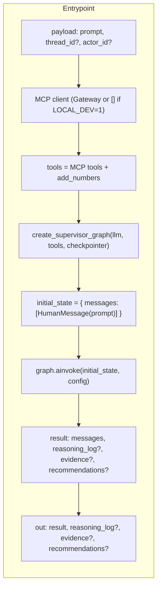
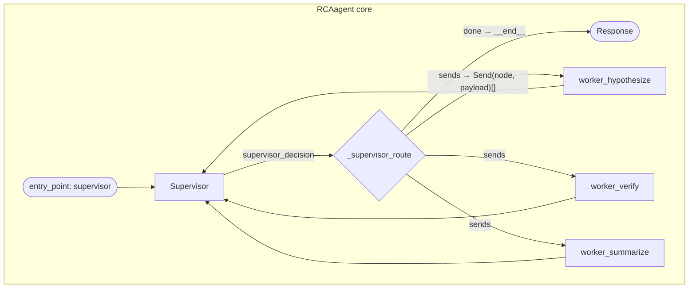
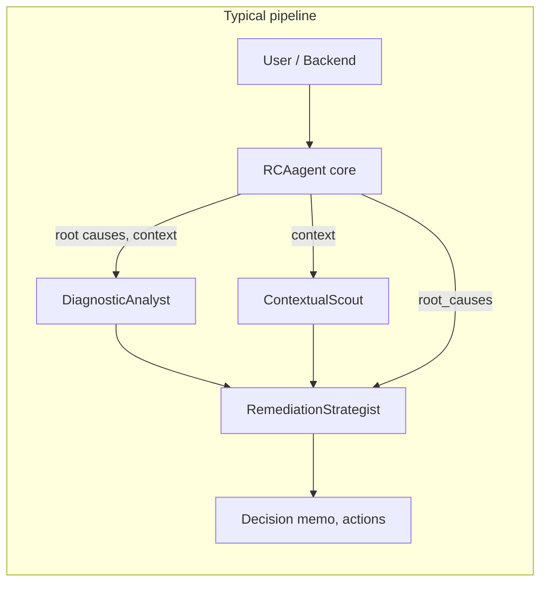
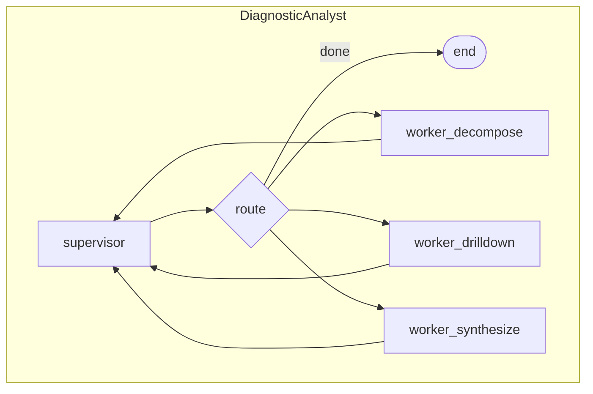
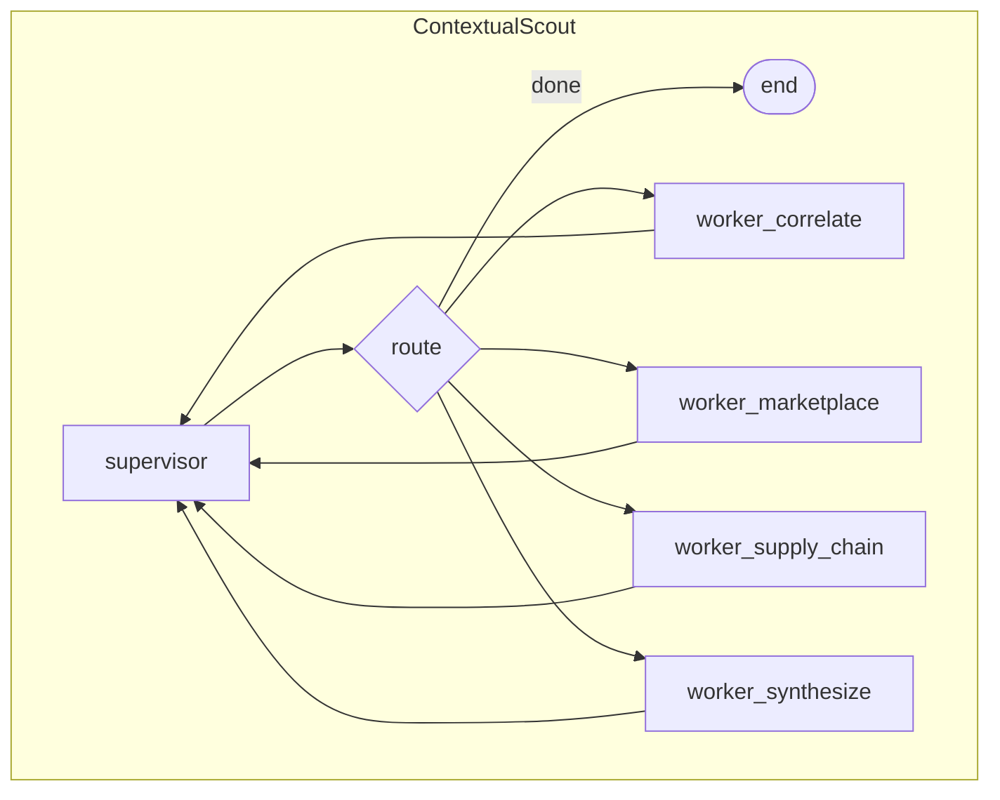
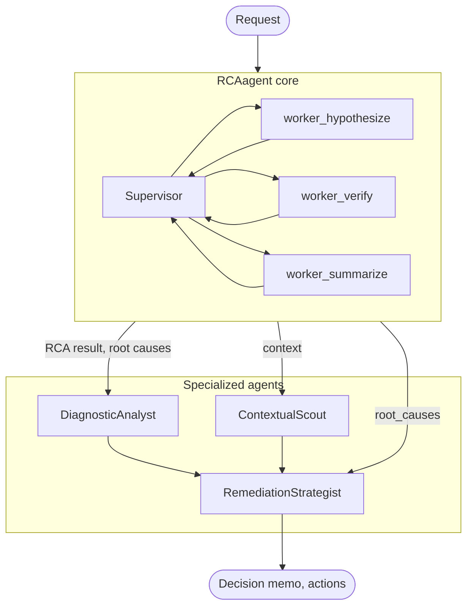

# RCAagent — Agent Flow Diagram

This document describes the exact agent workflow as implemented under `RCAagent/`. All diagrams match the code (LangGraph StateGraph, nodes, and entrypoints).

---

## 0. Request → Response (RCAagent core entrypoint)

Flow from HTTP/invoke payload to returned result. Implemented in `RCAagent/src/main.py`.

- **Entrypoint**: `BedrockAgentCoreApp()` + `@app.entrypoint` → `invoke(payload)`.
- **Tools**: Deployed: `get_streamable_http_mcp_client()` → `await mcp_client.get_tools()`. Local dev: `[]`. Then `all_tools = tools + [add_numbers]`.
- **Graph**: `create_supervisor_graph(llm, all_tools, checkpointer)`; optional `AgentCoreMemorySaver` when `MEMORY_ID` is set.
- **Config**: `configurable.thread_id`, `configurable.actor_id` for checkpointing.
- **Output**: Last non-human message content as `result`; optionally `reasoning_log`, `evidence`, `recommendations` from state.

---

## 1. RCAagent core graph (supervisor + workers)

Internal flow of the main RCAagent: one supervisor node routes to three worker nodes and can run workers in parallel via LangGraph `Send()`. Defined in `RCAagent/src/graph/graph.py` and `nodes.py`.

**State (`RCAGraphState`, `state.py`)**: `messages`, `hypotheses`, `evidence`, `recommendations`, `reasoning_log` (list reducers); `current_phase` (last-write); `supervisor_decision` (overwrite, drives conditional edge).

- **Supervisor**: Reads state (messages, hypotheses, evidence, reasoning_log), calls LLM with `SUPERVISOR_SYSTEM`, returns `{"done": true}` or `{"sends": [{"node": "<name>", "payload": {...}}, ...]}`. Valid nodes: `worker_hypothesize`, `worker_verify`, `worker_summarize`.
- **worker_hypothesize**: No tools. Uses `create_agent(llm, tools=[])`. Writes `hypotheses`, `reasoning_log`, `messages`, `current_phase`.
- **worker_verify**: Gets all MCP + local tools. Writes `evidence`, `reasoning_log`, `messages`, `current_phase`. Can be sent multiple times in parallel.
- **worker_summarize**: No tools. Writes `recommendations`, `reasoning_log`, `messages`, `current_phase`.
- After workers run, state is merged via reducers and control returns to the supervisor until it sets `done`.

---

## 2. Specialized agents (separate entrypoints)

Three specialized agents run as separate Bedrock AgentCore apps. They are typically invoked in sequence by a backend or orchestrator after (or alongside) the core RCAagent.

---

## 3. Specialized agent internal graphs

Each specialized agent is a separate Bedrock AgentCore app with its own supervisor + workers (same pattern: `set_entry_point("supervisor")`, `add_conditional_edges("supervisor", _supervisor_route)`, workers back to supervisor).

### 3a. DiagnosticAnalyst (`specializedAgents/DiagnosticAnalyst/`)

- **worker_decompose**: tools = `query_business_data`, `calculate_contribution_score`. Outputs: contribution_scores, kpi_slices.
- **worker_drilldown**: tool = `query_business_data` (per segment). Outputs: segment_breakdowns.
- **worker_synthesize**: no tools. Outputs: synthesis, data_quality_gaps, evidence.

### 3b. ContextualScout (`specializedAgents/ContextualScout/`)

- **worker_correlate**: tool = `social_signal_analyzer`. External signals / social correlation.
- **worker_marketplace**: tool = `marketplace_api_fetcher`. Marketplace checks.
- **worker_supply_chain**: tool = `inventory_mismatch_checker`. Supply chain audits.
- **worker_synthesize**: no tools. Evidence traces, confidence_scores.

### 3c. RemediationStrategist (`specializedAgents/RemediationStrategist/`)

```mermaid
flowchart TB
    subgraph rs [RemediationStrategist]
        S_RS[supervisor]
        S_RS --> R_RS{route}
        R_RS -->|done| E_RS([end])
        R_RS --> AM[worker_action_mapper]
        R_RS --> IS[worker_impact_simulator]
        R_RS --> P[worker_prioritizer]
        R_RS --> MG[worker_memo_generator]
        AM --> S_RS
        IS --> S_RS
        P --> S_RS
        MG --> S_RS
    end
```

- **worker_action_mapper**: tool = `map_remediation_action`. Maps root causes to actions.
- **worker_impact_simulator**: tool = `simulate_impact_range`. Impact projections.
- **worker_prioritizer**: tool = `assess_risk_level`. Prioritized actions, requires_approval (HITL).
- **worker_memo_generator**: no tools. Decision memo.

Initial state for RemediationStrategist can include `root_causes` from payload (from RCAagent or DiagnosticAnalyst).

---

## 4. Specialized agent summary

| Agent | Purpose | Key tools | Outputs |
|-------|---------|-----------|---------|
| **DiagnosticAnalyst** | Decompose revenue drop, rank drivers, drill down by segment | query_business_data, calculate_contribution_score | ranked_drivers (contribution_scores), kpi_slices, segment_breakdowns, data_quality_gaps, evidence |
| **ContextualScout** | External root causes: social signals, marketplace, supply chain | social_signal_analyzer, marketplace_api_fetcher, inventory_mismatch_checker | external_factors, marketplace_checks, supply_chain_audits, evidence_traces |
| **RemediationStrategist** | Map root causes to actions, simulate impact, prioritize, HITL for high risk | simulate_impact_range, map_remediation_action, assess_risk_level | remediation_actions, impact_projections, prioritized_actions, decision_memo, requires_approval |

RemediationStrategist accepts optional `root_causes` in the payload (e.g. from RCAagent or DiagnosticAnalyst output).

---

## 5. End-to-end flow (all agents)

- **RCAagent core**: Single entrypoint; supervisor coordinates hypothesize → verify → summarize (with optional parallel verify).
- **Specialized agents**: Separate entrypoints; invoked by client/backend with prompts and optional payload (e.g. root_causes for RemediationStrategist). Pipeline order is flexible; RemediationStrategist usually runs last with root causes from RCA or DiagnosticAnalyst.
